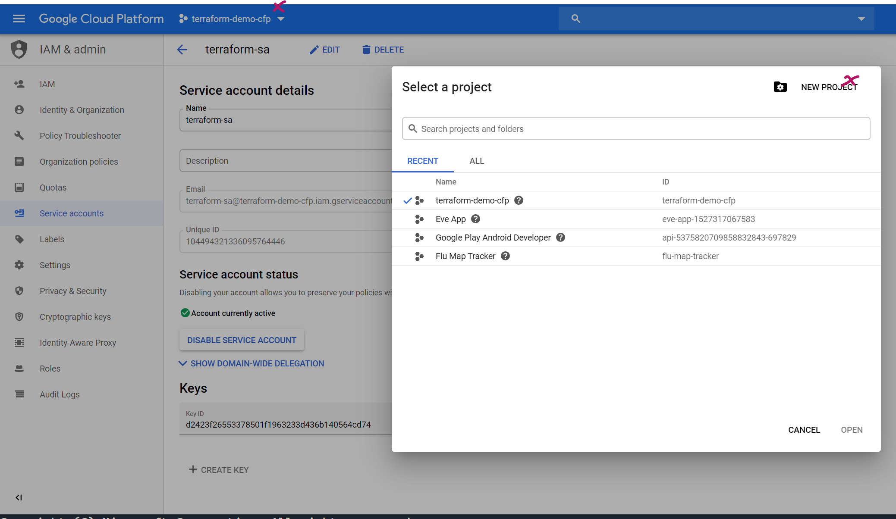
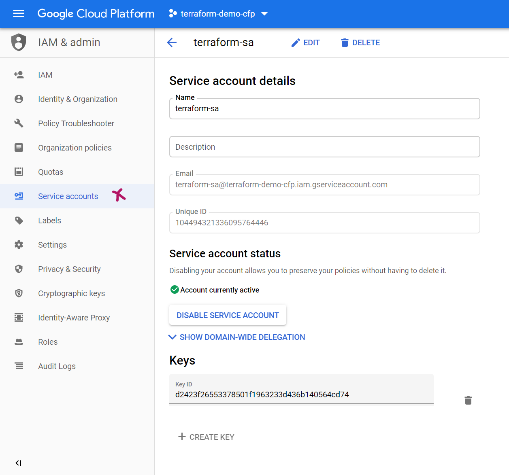
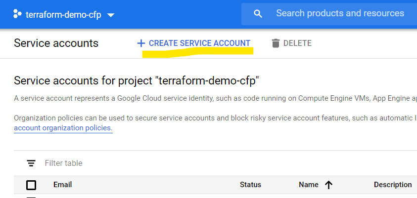
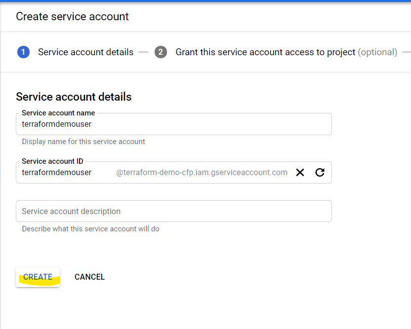
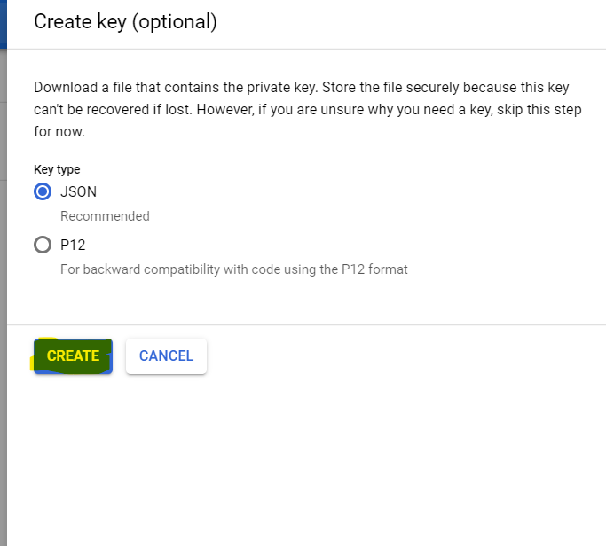

## Terraform in Google Cloud Platform

#### Requirements

- installed [Terraform CLI](https://www.terraform.io/downloads.html)
- create a project in your GCP Console



- create a service account json file and download it.



- create a service account and update it



- write an account name



- create a key



create Terraform file main.tf then add a [gcp provider](https://www.terraform.io/docs/providers/google/index.html).

For Terraform 13 compatibility

```sh
$ terraform 0.13upgrade .
```

The terraform init command is used to initialize a working directory containing Terraform configuration files.

```sh
$ terraform init
```

The terraform plan command is used to create an execution plan.

```sh
$ terraform plan
```

The terraform apply command is used to apply the changes required to reach the desired state of the configuration, or the pre-determined set of actions generated by a terraform plan execution plan.

Check your console.cloud.google.com/home/dashboard after running this.

```sh
$ terraform apply
```

 - Create SSH Key
```sh
ssh-keygen -t rsa -b 2048 -f mykey
```

 - Use SSH Client

```sh
ssh -i path-to-private-key username@external-ip
```

The terraform destroy command is used to destroy the Terraform-managed infrastructure.

```sh
$ terraform destroy
```
